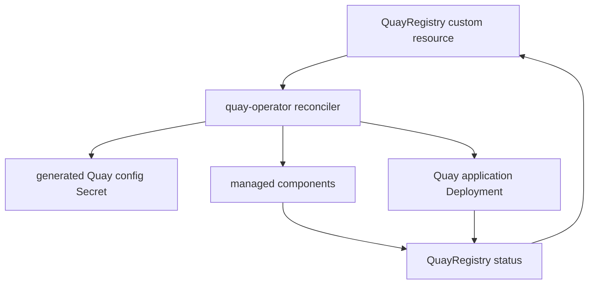

# quay-operator Architecture

`quay-operator` deploys and reconciles Quay on OpenShift/Kubernetes through the `QuayRegistry` custom resource. It owns Kubernetes resource generation, managed component lifecycle, status reporting, and upgrade-safe CRD behavior.



## High-Level Design

```
QuayRegistry CR
    ↓ Reconciliation
quay-operator
    ↓ Manage components
[Postgres, Redis, Clair, Quay app, Quay config, Clair postgres]
```

## Repository Layout

```text
apis/quay/v1/          QuayRegistry API types and generated DeepCopy code
controllers/quay/      reconciler, feature handling, TLS logic, status controller
pkg/kustomize/         Kubernetes object generation from QuayRegistry context
pkg/cmpstatus/         component readiness and condition evaluation
pkg/context/           derived runtime context used by reconciliation
pkg/tls/               TLS validation helpers
config/                Kubebuilder CRD, RBAC, manager, webhook, sample manifests
kustomize/             component base and overlay manifests rendered by the operator
bundle/                OLM bundle manifests and metadata
test/chainsaw/         cluster-level Chainsaw tests
hack/                  local deployment, formatting, release, and utility scripts
```

## Reconciliation Loop

```text
1. Watch QuayRegistry CR changes
2. Validate spec (required fields, component dependencies)
3. For each component:
   a. Check if managed or unmanaged
   b. If managed: create/update Deployment/StatefulSet/Service
   c. If unmanaged: validate external connection
4. Generate Quay config (config.yaml as Secret)
5. Deploy Quay application Deployment
6. Update QuayRegistry.status with component health
7. Requeue if not ready, otherwise wait for next change
```

The reconciler must stay idempotent. Repeated runs should converge resources to the desired state without breaking user-provided unmanaged component configuration.

## Managed Components

### Postgres (managed)
- StatefulSet with persistent volume
- Database init (schema creation)
- Credentials in Secret

### Postgres (unmanaged)
- User provides connection string
- Operator validates connectivity
- Schema must exist

### Redis (managed)
- Deployment + Service
- No persistence (cache only)

### Redis (unmanaged)
- User provides endpoint
- Operator validates connectivity

### Clair (managed)
- Separate Postgres for Clair
- Clair deployment + updater
- Vulnerability database sync

### Object Storage (managed)
- RHOCS/NooBaa integration (OpenShift only)
- ObjectBucketClaim creation

### Object Storage (unmanaged)
- S3/GCS/Azure credentials from Secret
- Operator validates bucket access

### Quay Application
- Deployment and supporting Kubernetes resources
- Generated Quay configuration from the config bundle and managed component data
- Service plus Route/Ingress where applicable

## Configuration Management

```text
QuayRegistry.spec.configBundleSecret → operator merges →
  [Component configs + user overrides] → Quay config Secret
    → Mounted in Quay pod at /conf/stack/config.yaml
```

## Upgrade Handling

```text
1. Detect Quay version change in CR
2. Update Quay deployment image
3. Run migration job (if required)
4. Rolling restart Quay pods
5. Update status with new version
```

## Generated Artifacts

API and manifest changes require regenerated output:

- API types in `apis/quay/v1/*_types.go` feed generated DeepCopy code through `make generate`.
- CRD, RBAC, and webhook manifests are generated with `make manifests`.
- `make manifests` also syncs the QuayRegistry CRD into `bundle/manifests/`.
- Kustomize manifests under `config/` and `kustomize/` are consumed by local deploy and bundle workflows.

## CRD Example

```yaml
apiVersion: quay.redhat.com/v1
kind: QuayRegistry
metadata:
  name: example-quay
spec:
  components:
    - kind: postgres
      managed: true
    - kind: redis
      managed: true
    - kind: clair
      managed: true
    - kind: objectstorage
      managed: false
  configBundleSecret: quay-config-override
```

## Status Reporting

```yaml
status:
  currentVersion: 3.11.0
  conditions:
    - type: Available
      status: "True"
      reason: ComponentsReady
  registryEndpoint: https://quay.example.com
  configEditorEndpoint: https://quay.example.com/config
```

## Validation

- `make test` runs unit tests with envtest assets.
- `make manager` builds the controller binary after generation, formatting, and vetting.
- `make run` runs the controller against the active `KUBECONFIG`.
- Chainsaw tests under `test/chainsaw/` cover cluster behavior such as reconciliation, TLS, HPA, storage, and unmanaged components.

## Integration Points

- `quay/quay`: application image and runtime configuration expectations.
- `quay-fbcs`: file-based catalog content for released operator bundles.
- `quay-konflux-components`: Konflux build definitions for operator and bundle images.
- `quay-tests`: broader Quay validation outside this operator repo.

## Review Risks

- CRD changes must preserve compatibility for existing `QuayRegistry` resources.
- Reconcile changes can loop or overwrite user-owned resources if managed/unmanaged boundaries are wrong.
- Generated CRD and bundle files can drift if `make generate` or `make manifests` is skipped.
- Status logic changes can block upgrades or hide unhealthy components.
